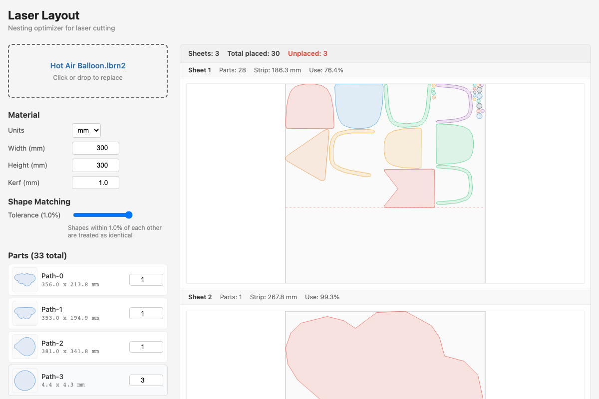

# Laser Layout

A nesting optimizer for laser cutting. Upload SVG or LightBurn (.lbrn2) design files, configure material sheet dimensions, and the app packs parts efficiently to minimize waste.



## Features

- **File import**: SVG and LightBurn (.lbrn2) formats with full path/shape support
- **Part deduplication**: Automatically identifies geometrically identical parts and tracks quantities
- **Genetic algorithm optimization**: Evolves rotation angles and placement order across generations
- **Multi-sheet nesting**: Overflows parts to additional sheets when one sheet fills up
- **Hole-aware placement**: Places smaller parts inside the cutouts of larger parts
- **Kerf support**: Configurable spacing between parts (default 1mm)
- **Live preview**: Real-time visualization of nesting progress via web worker
- **Export**: Save optimized layouts back to SVG or LightBurn format

## Getting Started

```sh
npm install
npm run dev
```

Open [http://localhost:5173](http://localhost:5173), upload a design file, adjust material settings, and click **Nest Parts**.

## Commands

```sh
npm run dev          # start dev server
npm run build        # production build
npm run preview      # preview production build
npm run lint         # ESLint
npm run check        # TypeScript + Svelte type checking
npm test             # unit tests (vitest)
npx playwright test  # e2e tests
```

## Tech Stack

- [SvelteKit](https://svelte.dev) with Svelte 5 runes
- TypeScript
- Vitest + Playwright
- ESLint with TypeScript and Svelte plugins
- Husky pre-commit hooks (lint + type-check + tests)
