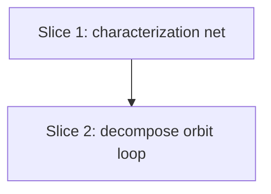

# Plan: Decompose `orbitingNFP`

**Created**: 2026-06-25
**Branch**: review/code-review-fixes
**Status**: implemented

## Goal

Decompose the ~132-line `orbitingNFP` function in `src/lib/nesting/orbiting-nfp.ts`
— whose orbit counter-loop interleaves five phases over a flat set of shared mutable
locals — into named phase helpers (`collectContacts`, `slideVectorsFor`,
`pickLongestSlide`, `hasReturnedToStart`) plus a bundled orbit-cursor struct. This is a
maintainability-only refactor: the function's public signature and its exact numeric
output for every input must be unchanged. Because the existing suites verify invariants
and wide-tolerance baselines (not exact values), the refactor is gated by a new
exact-output characterization net authored first.

## Approach stance

- **Scope**: strictly the decomposition in the spec — no algorithm, tolerance, or
  public-API change. The 12 report-only suggestions and the sibling `tryAdjacentPositions`
  refactor are explicitly out of scope.
- **Migrate-vs-edit-stub**: edit-in-place (reimplement the existing function over helpers);
  no parallel/duplicate implementation, no shim. The characterization net is the safety rail.
- **Replace-vs-merge**: N/A (no generated/managed artifact).
- No high-reversal-cost axis from `decision-defaults.md` is otherwise engaged.

## Acceptance Criteria

- [x] `orbitingNFP(staticPoly, orbitingPoly)` keeps its exact signature and return convention; `npm run check` passes.
- [x] Existing `test/nesting/orbiting-nfp.test.ts` property/fuzz suite passes unchanged (no test edits to accommodate the refactor).
- [x] `lego-shelves[nfp=1]` integration baselines unchanged — `trueFill` and sheet count identical (guaranteed by exact-output equality; integration test green).
- [x] A new exact-output characterization test pins `orbitingNFP` output (incl. shared-horizontal-edge and `null`-returning pairs) and stays green across the refactor.
- [x] `orbitingNFP` body is materially smaller; the five phases live in named helpers; complexity-review no longer flags the function.
- [x] Diff touches only `orbiting-nfp.ts` and its tests; no tolerance constants, `maxIter`, or algorithm parameters altered.
- [x] `npm run lint`, `npm run check`, `npm test` all pass.

## Slices

### Slice 1: Pin exact `orbitingNFP` output (characterization net)

**Depends-on:** none
**Files:** `test/nesting/orbiting-nfp.characterization.test.ts`

**Behavior:**

```gherkin
Feature: orbitingNFP exact-output contract

  Scenario: deterministic no-fit polygon for a concave pair
    Given a fixed pair of concave simple polygons
    When the no-fit polygon is computed
    Then it returns one specific sequence of offset vertices
    And recomputing it yields the identical sequence

  Scenario: pair whose orbit crosses coincident horizontal edges
    Given a polygon pair whose orbit traverses shared horizontal edges
    When the no-fit polygon is computed
    Then it returns the recorded exact offset sequence

  Scenario: degenerate pair whose orbit stalls and cannot close
    Given a polygon pair that enters the orbit loop but no feasible slide closes it
    When the no-fit polygon is computed
    Then it returns null

  Scenario: deterministic repeated computation
    Given the exact-output corpus polygon pair
    When orbitingNFP is called twice in succession with the same inputs
    Then both calls return deep-equal polygon arrays
```

**Steps:**

#### Step 1.1: Author the exact-output characterization corpus

**Complexity**: standard
**RED**: Write `orbiting-nfp.characterization.test.ts` asserting, for a fixed corpus of
concave pairs — at minimum one ordinary concave pair (with at least one reflex vertex,
e.g. the L-shape already used in the existing suite), one pair with shared horizontal
edges, and one pair that returns `null` — the **exact** offset-vertex sequences (and
`null`) returned by the current `orbitingNFP`. The `null` case must be a pair that
**enters the orbit loop and stalls** (`translate === null` / `maxd ≈ 0`), not a pre-loop
vertex-count rejection (`A.length < 3`), so the null-returning orbit path is genuinely
exercised. Capture the expected values at full precision (e.g. serialize via `JSON.stringify`)
and hard-code them as literals; assert with `toStrictEqual` (never `toBeCloseTo`) so the
test fails on any coordinate change. Confirm determinism by asserting two successive calls
are deep-equal.
**GREEN**: No production change — the test characterizes existing behavior and is green
against the current implementation (this is the regression net the refactor leans on).
**REFACTOR**: None needed.
**Files**: `test/nesting/orbiting-nfp.characterization.test.ts`
**Commit**: `test(nfp): pin exact orbitingNFP output as a refactor safety net`

### Slice 2: Decompose the orbit loop into named phases

**Depends-on:** 1
**Files:** `src/lib/nesting/orbiting-nfp.ts`

**Behavior:**

```gherkin
Feature: orbitingNFP internal decomposition preserves behavior

  Scenario: exact output unchanged after extraction
    Given the characterization corpus and the property/fuzz suite
    When orbitingNFP is reimplemented over named phase helpers and an orbit-cursor struct
    Then every computed no-fit polygon is identical to before the refactor

  Scenario: integration density unchanged
    Given the lego-shelves nfp=1 nesting baseline
    When parts are nested after the refactor
    Then trueFill and the sheet count match the baseline exactly
```

**Steps:**

> **Note on RED for Steps 2.1–2.3**: these are characterization-net refactor steps, so
> RED means "confirm the safety net is green before touching production code" — not "write
> a new failing test." The failing-first test was authored in Slice 1.

#### Step 2.1: Introduce the orbit-cursor struct and extract `collectContacts`

**Complexity**: standard
**RED (baseline check)**: No new test — Slice 1's characterization net plus the existing
property/fuzz suite are the gate; run them to confirm green before changing code.
**GREEN**: Bundle `{ refx, refy, offx, offy, Bo }` into an `OrbitCursor` struct local to
the function, and extract phase 1 (the type-0/1/2 contact scan, lines ~322–335) into
`collectContacts(A, Bo): Contact[]` with `type Contact = { type: 0 | 1 | 2; a: number; b: number }`.
Preserve exact iteration order and the `almostEqual`/`onSegment` predicates. Re-run the
characterization + property/fuzz suites **and the `lego-shelves[nfp=1]` baseline**; all stay green.
**REFACTOR**: Inline any redundant locals exposed by the extraction; keep operation order identical.
**Files**: `src/lib/nesting/orbiting-nfp.ts`
**Commit**: `refactor(nfp): extract collectContacts and bundle the orbit cursor`

#### Step 2.2: Extract `slideVectorsFor` and `pickLongestSlide`

**Complexity**: standard
**RED (baseline check)**: Run the characterization + property/fuzz suites; confirm green before editing.
**GREEN**: Extract phase 2 (per-contact candidate slide directions, lines ~339–360) into
`slideVectorsFor(contact, A, Bo): SlideVector[]` accumulated across contacts, and phase 3
(zero/anti-parallel rejection + `polygonSlideDistance` longest-feasible selection, lines
~363–381) into `pickLongestSlide(vectors, A, Bo, prev): { translate: SlideVector | null; maxd: number }`.
Pass `Bo` (and `prev`) **as parameters** — never close over them — because `Bo` is the
current-iteration snapshot and changes every cursor advance; an accidental closure capture
would silently read a stale body (the characterization net catches this immediately).
Preserve the `1e-4` anti-parallel threshold and the exact comparison order. Re-run the
characterization + property/fuzz suites **and the `lego-shelves[nfp=1]` baseline**; all stay green.
**REFACTOR**: None beyond keeping the call sequence readable.
**Files**: `src/lib/nesting/orbiting-nfp.ts`
**Commit**: `refactor(nfp): extract slideVectorsFor and pickLongestSlide`

#### Step 2.3: Extract `hasReturnedToStart` and finalize

**Complexity**: standard
**RED (baseline check)**: Run the characterization + property/fuzz suites; confirm green before editing.
**GREEN**: Extract phase 5 (loop-closure detection) preserving the existing **short-circuit
order**: the start-revisit break (line ~402) is checked first and, only when it does not
match, the non-start trace scan (lines ~404–412) runs. To keep that order unmistakable,
prefer **two helpers** — `hasClosedOrbit(refx, refy, startx, starty): boolean` and
`hasRevisitedTrace(refx, refy, trace): boolean` — called in that sequence, rather than one
helper that hides both conditions (the single-helper spelling risks scanning `trace` even
when the start already matched, which changes evaluation order). The main loop now reads
collect → vectors → pick → trim & advance cursor → test closure → advance `Bo`. Suites stay green.
**REFACTOR**: Final readability pass; confirm `orbitingNFP` body is materially smaller and
nesting depth reduced. Run `npm run lint`, `npm run check`, `npm test`, and the
`lego-shelves[nfp=1]` baseline check.
**Files**: `src/lib/nesting/orbiting-nfp.ts`
**Commit**: `refactor(nfp): extract loop-closure detection; finish orbitingNFP decomposition`

## Parallelization

Slices are strictly sequential — Slice 2 leans on Slice 1's characterization net.



| Wave | Slices (parallel) |
| ---- | ----------------- |
| 1    | 1                 |
| 2    | 2                 |

## Complexity Classification

All steps are `standard`: localized extractions within one function, behaviorally gated by
an exact-output net. No architectural change, new abstraction, or security surface — so no
`complex` step (the numerical sensitivity raises test rigor, already addressed by Slice 1,
not structural complexity).

## Pre-PR Quality Gate

CI-enforced:

- [ ] All tests pass (`npm test`) — includes the characterization net and property/fuzz suite
- [ ] Type check passes (`npm run check`)
- [ ] Linter passes (`npm run lint`)
- [ ] `lego-shelves[nfp=1]` baseline (`trueFill` + sheet count) unchanged — checked via the
      density integration test / `npm run bench` `nfp=1` row against the recorded values

Human-review-only (not mechanically gated — verified at PR review):

- [ ] AC #5 "complexity-review no longer flags the function" — qualitative; confirm `orbitingNFP`
      is materially smaller and the five phases are extracted
- [ ] AC #6 "diff touches only `orbiting-nfp.ts` + tests; no tolerance/`maxIter`/param changes" —
      confirm by reading the diff
- [ ] `/code-review` passes
- [ ] Documentation updated (N/A — internal refactor, no public contract change)

## Risks & Open Questions

- **Wide-tolerance test blind spot** (the deferral reason): mitigated by Slice 1's
  exact-output net, authored before any production change.
- **Operation-order drift during extraction**: the refactor must preserve floating-point
  operation order for bit-identical results; each step re-runs the net immediately, so a
  perturbation surfaces at the step that caused it.
- **Capturing expected literals**: the characterization expectations are captured from the
  current implementation. If the current output were already wrong, the net would pin the
  wrong values — acceptable, because the goal is _equivalence_, not correctness re-litigation.

## Build Progress

### Slices (grouped by wave)

#### Wave 1

- [x] Slice 1: Pin exact `orbitingNFP` output (characterization net)
  - [x] Step 1.1: Author the exact-output characterization corpus

#### Wave 2

- [x] Slice 2: Decompose the orbit loop into named phases
  - [x] Step 2.1: Introduce the orbit-cursor struct and extract `collectContacts`
  - [x] Step 2.2: Extract `slideVectorsFor` and `pickLongestSlide`
  - [x] Step 2.3: Extract loop-closure helpers (`hasClosedOrbit`/`hasRevisitedTrace`) and finalize

### Acceptance Criteria

- [x] Public signature + return convention unchanged; `npm run check` passes
- [x] Existing property/fuzz suite passes unchanged
- [x] `lego-shelves[nfp=1]` baselines (`trueFill` + sheet count) unchanged — guaranteed by exact-output equality; `density-nesting.integration.test.ts` green (bench confirmatory)
- [x] Exact-output characterization test pins output and stays green
- [x] `orbitingNFP` decomposed into named helpers; complexity-review no longer flags it
- [x] Diff touches only `orbiting-nfp.ts` + tests; no tolerance/param changes
- [x] `npm run lint`, `npm run check`, `npm test` all pass

## Plan Review Summary

**Plan tier: standard** — reviewers: Acceptance Test Critic, Design & Architecture Critic,
Parallelization Critic. UX skipped (no user-facing/UI surface); Strategic not dispatched at
this tier. All three returned **approve**, zero blockers. The warnings below were addressed
in-plan before the human gate.

**Acceptance Test Critic** (approve): folded in —

- Added a determinism Gherkin scenario (covers "recomputing yields identical sequence").
- Step 1.1 now requires the `null` case to be a loop-stall pair (not a vertex-count rejection),
  full-precision literal capture, and `toStrictEqual` (not `toBeCloseTo`).
- Steps 2.1–2.2 now re-run the `lego-shelves[nfp=1]` baseline (not only at 2.3).
- RED relabeled "baseline check" for refactor steps to clarify the characterization rhythm.
- Acknowledged (not gated in CI): AC #5 (complexity-review) and AC #6 (diff-scope) are
  human-review-only — now split out explicitly in the Pre-PR Quality Gate.

**Design & Architecture Critic** (approve): folded in —

- Step 2.3 now prescribes two helpers (`hasClosedOrbit` then `hasRevisitedTrace`) to preserve
  the existing short-circuit order, rather than one helper that could reorder the trace scan.
- Step 2.2 now mandates passing `Bo`/`prev` as parameters, never closing over them (Bo mutates
  each iteration; a stale closure would silently diverge).
- Observations: scope is a clean intra-module extraction (no new files/exports, no dependency or
  layer concerns); the `OrbitCursor` grouping is genuine cohesion; phase 4 stays inline by design.

**Parallelization Critic** (approve, trivial): fully sequential plan (2 waves × 1 slice,
empty collisions array) — no same-wave concurrency to validate.
