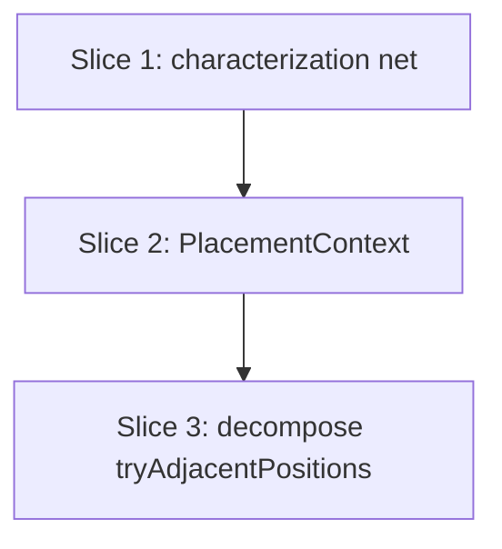

# Plan: Decompose `tryAdjacentPositions` (+ `PlacementContext`)

**Created**: 2026-06-25
**Branch**: review/code-review-fixes
**Status**: approved

## Goal

Decompose the ~138-line `tryAdjacentPositions` on the exact/NFP placement hot path in
`src/lib/nesting/placement.ts` into three named helpers (`collectCandidatePositions`,
`filterAndScoreInSheet`, `validateBest`) so it reads generate → score → heapify → validate,
and bundle the repeated `(cache, sheet, kerf, exact, nfpCtx)` tuple into a `PlacementContext`
threaded through the private placement helpers. This is a maintainability-only refactor:
per CLAUDE.md, `placement.ts` changes must be **byte-for-byte behaviour-preserving given the
same RNG** — identical placements for the same parts, seed, and config. Because the
integration tests' wide tolerances can't tightly verify placement equivalence, the refactor
is gated by a new characterization net that pins exact `bottomLeftFill` output (both the fast
bbox path and the exact NFP path) before any production change.

## Approach stance

- **Scope**: strictly the spec's two paired changes (decompose + `PlacementContext`). No
  scoring/budget/anchor/algorithm change. The sibling `orbitingNFP` refactor (already shipped
  on this branch) and the 12 report-only suggestions are out of scope.
- **Migrate-vs-edit-stub**: edit-in-place — reimplement the existing private functions over the
  helpers/context; no parallel implementation, no shim. The characterization net is the rail.
- **Public API**: unchanged. The only export, `bottomLeftFill(parts, sheet, kerf, exact, nfpCache)`,
  keeps its signature; `PlacementContext` is built inside it and threaded to private helpers only.
- **Replace-vs-merge**: N/A. No high-reversal-cost axis otherwise engaged.

## Decisions resolved before build (from plan review)

1. **`PlacementContext` field name** — the bundled `PlacedIndex` is named **`index`**, not `cache`,
   to avoid a readability collision with `NfpCtx.cache` (an `NfpCache`). So `ctx.index` is the
   `PlacedIndex` and `ctx.nfpCtx?.cache` is the `NfpCache` — distinct names one level apart.
2. **`checkOverlap` is threaded too, partially** — it keeps its per-call `placements` argument (a
   `cache.query()` result, not a static tuple member) and additionally receives `ctx`, reading only
   `ctx.kerf`/`ctx.exact`/`ctx.nfpCtx` (it needs neither `index` nor `sheet`). This satisfies the
   spec's "thread through `checkOverlap`" while documenting that it consumes a subset of the context.
3. **`collectCandidatePositions` signature supersedes the spec's** — the spec wrote a positional
   `(cache, partBB, kerf, exact, nfpCtx)` that predates `PlacementContext`; since Part B (Slice 2)
   ships first, the helper takes `(partBB, ctx)`. Same inputs, bundled.
4. **Bench equivalence is confirmatory, not a CI gate** — `lego-shelves[nfp=0|1]` rows are verified
   by running the bench and eyeballing the rows against a pre-refactor run; there is no stored CI
   baseline. The exact-placement net (Slice 1) is the *mechanical* equivalence gate and is strictly
   stronger (identical placements ⇒ identical bench rows).

## Acceptance Criteria

- [ ] `bottomLeftFill`'s public signature is unchanged; `npm run check` passes.
- [ ] `test/nesting/placement.test.ts` passes unchanged (no test edits to accommodate the refactor).
- [ ] A new characterization net pins exact `bottomLeftFill` placements for a fixed parts/sheet/kerf/config on both the fast bbox path (`nfpCtx` undefined) and the exact NFP path (`nfpCtx` present), and stays green across the refactor.
- [ ] `lego-shelves[nfp=0]` and `[nfp=1]` bench rows (`trueFill` + sheet count) match a pre-refactor run (confirmatory; guaranteed by exact-placement equality).
- [ ] `tryAdjacentPositions` delegates to `collectCandidatePositions`, `filterAndScoreInSheet`, `validateBest`; complexity-review no longer flags it.
- [ ] `PlacementContext` bundles `{index, sheet, kerf, exact, nfpCtx}` and is threaded through `hasCollision`, `checkOverlap` (partial), `slideBottomLeft`, `tryAdjacentPositions`, `tryGridFallback`, `findBestPosition`; the five-element positional tuple no longer recurs across their signatures.
- [ ] Diff touches only `placement.ts` and its tests; no budget (`VALIDATE_BUDGET`/`SLIDE_BUDGET`), scoring, tolerance, or anchor-source constant changes.
- [ ] `npm run lint`, `npm run check`, `npm test` all pass.

## Slices

### Slice 1: Pin exact `bottomLeftFill` placements (characterization net)

**Depends-on:** none
**Files:** `test/nesting/placement.characterization.test.ts`

**Behavior:**

```gherkin
Feature: bottomLeftFill exact-placement contract

  Scenario: deterministic placement on the fast bbox path
    Given a fixed ordered set of parts, a sheet, and a kerf with NFP placement off
    When the parts are placed by bottom-left fill
    Then each part lands at one specific position and rotation
    And placing the same inputs again yields the identical placements

  Scenario: deterministic placement on the exact NFP path
    Given the same parts, sheet, and kerf with NFP placement on
    When the parts are placed by bottom-left fill
    Then each part lands at one specific position and rotation
    And placing the same inputs again yields the identical placements

  Scenario: an unplaceable part is reported, not forced
    Given a part too large to fit the remaining sheet area
    When the parts are placed by bottom-left fill
    Then that part is reported unplaced rather than overlapping another
```

**Steps:**

#### Step 1.1: Author the exact-placement characterization corpus

**Complexity**: standard
**RED**: Write `placement.characterization.test.ts` calling `bottomLeftFill` on a fixed,
ordered set of small polygon parts with a fixed sheet and kerf, once with `nfpCache` absent
(fast bbox path) and once present (exact NFP path). `bottomLeftFill` is deterministic given
ordered parts (the GA owns order/rotation upstream), so assert the **exact** placed positions
and rotations with `toStrictEqual` (never `toBeCloseTo`) over the full placed-part array;
store the expected values as full-precision JavaScript number literals (no rounding) captured
from the current implementation. Use a corpus where **at least one part fits and at least one
does not**, so the placed array is non-trivially non-empty and asserting the unfit part is
reported unplaced is not vacuously true. Keep a **committed discriminability guard** —
`expect(placed).not.toStrictEqual(<a deliberately-wrong snapshot>)` — so a future reader can see
from the test file that the net catches a drift, plus an inline comment noting the perturbation
method used to verify sensitivity at authoring time.
**GREEN**: No production change — the net characterizes existing behavior and is green against
the current implementation (the regression rail the refactor leans on).
**REFACTOR**: None needed.
**Files**: `test/nesting/placement.characterization.test.ts`
**Commit**: `test(placement): pin exact bottomLeftFill placements as a refactor safety net`

### Slice 2: Introduce `PlacementContext` (Part B)

**Depends-on:** 1
**Files:** `src/lib/nesting/placement.ts`

**Behavior:**

```gherkin
Feature: PlacementContext threading preserves placement

  Scenario: bundled context produces identical placements
    Given a fixed ordered set of parts, a sheet, kerf, and config with known placements
      on both the fast bbox path and the exact NFP path
    When the placement helpers receive the cache/sheet/kerf/exact/nfpCtx values bundled
      into a single PlacementContext instead of as positional arguments
    Then every placed position and rotation is identical to before, on both paths

  Scenario: placements accumulate through the shared context during a fill
    Given a PlacementContext built once before a sheet is filled
    When successive parts are placed and added to the shared placed-part index
    Then each later part is placed clear of every earlier part in the same fill
    And the final placed set is identical to filling without the context bundling
```

**Steps:**

#### Step 2.1: Bundle the tuple into `PlacementContext` and thread it

**Complexity**: standard
**RED (baseline check)**: Run the characterization net + `placement.test.ts`; confirm green before editing.
**GREEN**: Add `interface PlacementContext { index: PlacedIndex; sheet: MaterialSheet; kerf: number; exact: boolean; nfpCtx?: NfpCtx }`.
Construct it once inside `bottomLeftFill` (where `cache`/`sheet`/`kerf`/`exact`/`nfpCtx` already
exist). The `index` field holds the per-sheet `PlacedIndex` **by reference**, so parts added to it
during the fill remain visible through `ctx.index` without rebuilding the context. Thread `ctx`
through `hasCollision`, `slideBottomLeft`, `tryAdjacentPositions`, `tryGridFallback`, and
`findBestPosition`, replacing their five positional params (`findBestPosition` keeps its separate
`holes` param; the others keep their leading geometry params). Thread it through `checkOverlap`
too, but `checkOverlap` keeps its per-call `placements` argument and reads only `ctx.kerf`/`ctx.exact`/`ctx.nfpCtx`.
No values change. Re-run the net + `placement.test.ts`; identical. Then run the
`lego-shelves[nfp=0|1]` bench rows and confirm `trueFill`/sheet count match a pre-refactor run.
**REFACTOR**: Remove now-redundant local destructuring; keep call order identical.
**Files**: `src/lib/nesting/placement.ts`
**Commit**: `refactor(placement): bundle the placement tuple into PlacementContext`

### Slice 3: Decompose `tryAdjacentPositions` (Part A)

**Depends-on:** 2
**Files:** `src/lib/nesting/placement.ts`

**Behavior:**

```gherkin
Feature: tryAdjacentPositions decomposition preserves placement

  Scenario: extracted helpers produce identical placements
    Given a fixed ordered set of parts, a sheet, kerf, and config with known placements
      on both the fast bbox path and the exact NFP path
    When tryAdjacentPositions is reimplemented over collectCandidatePositions,
      filterAndScoreInSheet, and validateBest
    Then every placed position and rotation is identical to before, on both paths

  Scenario: tied candidates resolve to the same placement as before
    Given a fixed ordered set of parts, a sheet, and kerf for which the pre-refactor run
      produces at least one part with multiple equally-scored candidate positions
    When they are placed before and after the decomposition
    Then each part's placed position is byte-for-byte identical
```

**Steps:**

#### Step 3.1: Extract `collectCandidatePositions`

**Complexity**: standard
**RED (baseline check)**: Run the characterization net + `placement.test.ts`; confirm green before editing.
**GREEN**: Extract the candidate-generation block (legacy `candidateAnchors`, `exact`-gated
`concavityAnchors`, per-pair `nfpCandidateAnchors`, and the `nfpCtx`-gated `feasibleVertices(...)`
NFP-union augmentation) into `collectCandidatePositions(partBB, ctx) -> Point[]` (bundled form,
superseding the spec's positional signature). **Preserve the exact append order** of candidate
sources — it feeds heap tiebreaks and must stay identical. Re-run the net + `placement.test.ts`; identical.
**REFACTOR**: None beyond keeping the helper cohesive.
**Files**: `src/lib/nesting/placement.ts`
**Commit**: `refactor(placement): extract collectCandidatePositions`

#### Step 3.2: Extract `filterAndScoreInSheet` and `validateBest`

**Complexity**: standard
**RED (baseline check)**: Run the characterization net + `placement.test.ts`; confirm green before editing.
**GREEN**: Extract the in-sheet filter + `ScoredPosition` construction into
`filterAndScoreInSheet(positions, partBB, union, ctx) -> ScoredPosition[]` (same `resultingStrip`
and `bl` scores, same `better` comparator), and the budgeted validate-and-slide loop into
`validateBest(heap, normalizedPoly, partBB, union, ctx) -> ScoredPosition | null`. `validateBest`
receives `union` explicitly (matching `filterAndScoreInSheet`'s convention) and reconstructs the
trivial `bl`/`better` closures from `ctx` (`bl` over `ctx.sheet.width`, `better` keyed on
`ctx.nfpCtx` presence); it keeps the same `VALIDATE_BUDGET`/`SLIDE_BUDGET` (80/12 with NFP, 40/6
without), the same `hasCollision` gate, the same `slideBottomLeft` settle, and the same
`recordBudgetOutcome` call site/arguments. `tryAdjacentPositions` then reads: build candidates →
score → `createPositionHeap` → `validateBest`. Re-run the net + `placement.test.ts`; identical.
Then run the `lego-shelves[nfp=0|1]` bench rows and confirm `trueFill`/sheet count match a pre-refactor run.
**REFACTOR**: Final readability pass; confirm complexity-review no longer flags `tryAdjacentPositions`.
**Files**: `src/lib/nesting/placement.ts`
**Commit**: `refactor(placement): extract filterAndScoreInSheet and validateBest`

## Parallelization

Strictly sequential — Slices 2 and 3 both edit `placement.ts` and Slice 3 builds on Slice 2's
context; all lean on Slice 1's net.



| Wave | Slices (parallel) |
|------|-------------------|
| 1 | 1 |
| 2 | 2 |
| 3 | 3 |

## Complexity Classification

All steps are `standard`: localized extractions and a mechanical param-bundling within one
file, behaviorally gated by an exact-placement net. No architectural change, new abstraction,
or security surface — the hot-path sensitivity raises test rigor (Slice 1), not structural
complexity. No public API change.

## Pre-PR Quality Gate

CI-enforced:

- [ ] All tests pass (`npm test`) — includes the characterization net and `placement.test.ts`
- [ ] Type check passes (`npm run check`)
- [ ] Linter passes (`npm run lint`)

Human-review-only / confirmatory (not mechanically gated):

- [ ] `lego-shelves[nfp=0]` and `[nfp=1]` bench rows (`trueFill` + sheet count) match a pre-refactor run
- [ ] Decomposition + `PlacementContext` threading match the spec; complexity-review no longer flags the function
- [ ] Diff touches only `placement.ts` + tests; no budget/scoring/tolerance/anchor change
- [ ] `/code-review` passes
- [ ] Documentation updated (N/A — internal refactor, no public contract change)

## Risks & Open Questions

- **Wide-tolerance blind spot** (the deferral reason): mitigated by Slice 1's exact-placement net,
  authored before any production change, covering both the bbox and NFP paths.
- **Cache held by reference** — `PlacementContext.index` aliases the per-sheet `PlacedIndex` that
  `bottomLeftFill` mutates as parts are placed; the context is built once and reused so those
  mutations stay visible (intended — covered by the Slice 2 accumulation scenario).
- **Append-order sensitivity** — candidate source order feeds heap tiebreaks under equal
  `strip`/`bl`; Step 3.1 must preserve it for byte-for-byte equivalence. The net catches a drift.
- **`validateBest` derived inputs** — `union` is passed explicitly; `bl`/`better` are reconstructed
  from `ctx`. If a future change makes `better` depend on more than `nfpCtx` presence, the helper's
  inputs must be revisited.

## Plan Review Summary

**Plan tier: standard** — reviewers: Acceptance Test Critic, Design & Architecture Critic,
Parallelization Critic (UX skipped — no UI surface; Strategic not dispatched at this tier).
Two review iterations.

- **Parallelization Critic** (approve): fully sequential (3 waves × 1 slice, empty collisions);
  slices 2 & 3 both edit `placement.ts` but in different waves — correct, not a collision.
- **Design & Architecture Critic** (iter 1 → needs-revision; iter 2 → **approve**): folded in —
  `PlacementContext.cache` renamed to **`index`** (collision with `NfpCtx.cache`); `validateBest`
  takes `union` explicitly and reconstructs `bl`/`better` from `ctx`; `collectCandidatePositions(partBB, ctx)`
  explicitly supersedes the spec's positional signature. Confirmed `checkOverlap` partial-threading
  and cache-by-reference aliasing are sound.
- **Acceptance Test Critic** (iter 1 → needs-revision [1 blocker]; iter 2 → 4 warnings, no blockers):
  iter-1 blocker resolved by including `checkOverlap` in the threaded set (partial). Iter-2 warnings
  addressed directly without a third loop: tied-candidate scenario Given reworded to external inputs;
  characterization net gains a **committed** discriminability guard (`not.toStrictEqual` + perturbation
  note) and a corpus with both a fitting and an unfit part (no vacuous assertion); spec-vs-plan
  deviations (field name `index`, bench-as-confirmatory) reconciled by a spec **Amendments** section so
  spec-compliance review won't flag them.

All blockers cleared; Design approves; residual Acceptance items were warnings, now addressed in-plan.

## Build Progress

### Slices (grouped by wave)

#### Wave 1

- [ ] Slice 1: Pin exact `bottomLeftFill` placements (characterization net)
  - [ ] Step 1.1: Author the exact-placement characterization corpus

#### Wave 2

- [ ] Slice 2: Introduce `PlacementContext` (Part B)
  - [ ] Step 2.1: Bundle the tuple into `PlacementContext` and thread it

#### Wave 3

- [ ] Slice 3: Decompose `tryAdjacentPositions` (Part A)
  - [ ] Step 3.1: Extract `collectCandidatePositions`
  - [ ] Step 3.2: Extract `filterAndScoreInSheet` and `validateBest`

### Acceptance Criteria

- [ ] `bottomLeftFill` public signature unchanged; `npm run check` passes
- [ ] `placement.test.ts` passes unchanged
- [ ] Characterization net pins exact placements (bbox + NFP paths) and stays green
- [ ] `lego-shelves[nfp=0|1]` bench rows (`trueFill` + sheet count) match a pre-refactor run
- [ ] `tryAdjacentPositions` decomposed into the three helpers; complexity-review no longer flags it
- [ ] `PlacementContext` threaded through the six private helpers; positional tuple gone
- [ ] Diff touches only `placement.ts` + tests; no budget/scoring/tolerance/anchor change
- [ ] `npm run lint`, `npm run check`, `npm test` all pass
