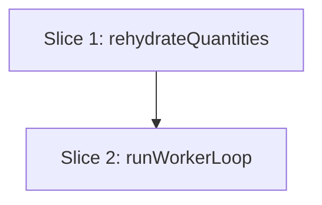

# Plan: Extract a testable driver from nesting-worker.ts

**Created**: 2026-06-24
**Branch**: test/seed-and-dedup-helpers (refactor should land on its own branch — see Risks)
**Status**: in-progress

## Goal

`src/lib/nesting/nesting-worker.ts` entangles its real logic — quantities rehydration, the
generation-stepping loop, and the wall-clock budget cutoff — with the Web Worker global scope
(`self.onmessage`/`self.postMessage`), `Date.now()`, and `setTimeout`. None of that logic is
directly unit-tested today; it is only exercised indirectly through `nesting-coordinator.test.ts`'s
fake-worker tests. This plan introduces a testability seam — mirroring the dependency injection the
coordinator already uses (`setTimer`/`clearTimer`, injected worker factory) — so the rehydration and
the drive/budget/error logic become pure, injectable functions verified without a real Worker, clock,
or timer. The change is **behavior-preserving**: given the same `start` message, the sequence and
content of posted `WorkerResponse` messages is unchanged; `self.onmessage` is reduced to a thin
adapter.

## Approach stance (high-reversal-cost axes)

- **Migrate-vs-edit-stub**: _edit in place_. We extract functions within the existing module and
  keep `self.onmessage` as an adapter — no parallel module, no behavior change.
- **Scope**: _strictly this refactor_. No change to the nesting algorithm, the budget semantics, the
  message protocol, or the coordinator. New abstraction is limited to an injected-dependencies seam
  consistent with the existing coordinator pattern.
- All other axes (replace-vs-merge, format fidelity, auto-merge) are untouched by this task.

## Acceptance Criteria

- [ ] `rehydrateQuantities` is exported and unit-tested against all serialized forms (Map, Array,
      plain object, numeric-string object) and the empty case — no Web Worker involved. A Map input
      is returned as a new Map (copy, not the same reference), and string values are coerced verbatim
      via `Number(...)` (a non-numeric string therefore yields `NaN` — pinned, not "fixed").
- [ ] `runWorkerLoop` is exported and unit-tested with injected `post`, `now`, `schedule`, and
      generator factory — no real Worker, no real clock, no real `setTimeout`.
- [ ] Behavior is preserved: the existing `nesting-coordinator` and engine suites still pass, and the
      message sequence for a `start` message is unchanged.
- [ ] A generator that returns immediately (zero yields) posts exactly one `done` and no `progress`.
- [ ] The budget cutoff posts the best-so-far `done` and stops stepping once `now()` reaches the
      deadline **and** a result exists; it never posts `done` before any result exists; and once a
      result does arrive while past the deadline, `done` is posted on that step.
- [ ] A generator error and a setup/rehydration error each surface as exactly **one** `error` message
      (no trailing progress/done) carrying the exact error text, including the non-`Error` throw path
      (`String(err)`).
- [ ] An exported `handleMessage(data, deps)` adapter posts nothing for any non-`start` message;
      `self.onmessage` delegates to it and is the only module-level side-effect.

## Slices

A slice is a vertically deliverable increment. Steps are numbered `<slice>.<step>`.

### Slice 1: Extract `rehydrateQuantities`

**Depends-on:** none
**Files:** `src/lib/nesting/nesting-worker.ts`, `test/nesting/nesting-worker.test.ts`

**Behavior:**

```gherkin
Feature: Rehydrate part quantities from a structured-clone-serialized message

  Scenario: A Map is returned as an equal copy
    Given a quantities value that is a Map of part id to count
    When the worker rehydrates it
    Then the result is a new Map equal in entries to the input
      And the result is not the same Map reference

  Scenario: An array of pairs becomes a map
    Given a quantities value that is an array of [id, count] pairs
    When the worker rehydrates it
    Then the result is a Map with one entry per pair

  Scenario: A plain object becomes a map
    Given a quantities value that is a plain object of id to count
    When the worker rehydrates it
    Then the result is a Map with one entry per property

  Scenario: Object values are coerced to numbers
    Given a plain object whose counts are numeric strings
    When the worker rehydrates it
    Then every resulting count is a number equal to the parsed value

  Scenario: A non-numeric object value is coerced verbatim
    Given a plain object whose count for a part is the string "abc"
    When the worker rehydrates it
    Then that part's count is NaN (the existing Number(...) behavior, pinned not fixed)

  Scenario: An empty input yields an empty map
    Given a quantities value that is an empty Map, array, or object
    When the worker rehydrates it
    Then the result is an empty Map
```

**Steps:**

#### Step 1.1: Extract and export `rehydrateQuantities`

**Complexity**: standard
**RED**: In a new `test/nesting/nesting-worker.test.ts`, write `describe('rehydrateQuantities')`
cases for the six scenarios above (Map→equal copy with `not.toBe` on the reference, array→Map,
object→Map, numeric-string coercion, non-numeric→NaN, empty→empty Map).
**GREEN**: Move the inline `raw instanceof Map / Array.isArray / Object.entries(...).map(Number)`
block out of `self.onmessage` into an exported
`export function rehydrateQuantities(raw: Map<string, number> | readonly [string, number][] | Record<string, number | string>): Map<string, number>`.
Do **not** annotate the param as `NestingInput['quantities']` — that resolves to `Map<string,number>`
in `engine.ts` and would make the Array/object branches dead code or fail typecheck; the wire form
arrives structured-cloned, so the union is the honest type. Have the handler call it. Preserve the
existing `Number(v)` coercion (NaN passthrough) and the Map-copy semantics (`new Map(entries)`, never
the original reference) exactly.
**REFACTOR**: None needed (logic is lifted verbatim; only the type annotation widens to the wire form).
**Files**: `src/lib/nesting/nesting-worker.ts`, `test/nesting/nesting-worker.test.ts`
**Commit**: `refactor(worker): extract testable rehydrateQuantities helper`

### Slice 2: Extract `runWorkerLoop` with injected dependencies

**Depends-on:** 1
**Files:** `src/lib/nesting/nesting-worker.ts`, `test/nesting/nesting-worker.test.ts`

**Behavior:**

```gherkin
Feature: Drive the nesting generator, reporting progress and enforcing the budget

  Background:
    Given an injected post spy, a controllable clock, a controllable scheduler,
      and a fake generator factory

  # The scheduler fake captures the continuation; the test invokes it once per generation
  # (the same control style as nesting-coordinator.test.ts's setTimer `fire`).

  Scenario: Each generation is reported, then a final done
    Given a generator that yields two progress values and returns a final result
    When the test drives the captured scheduler step once per yield until the generator returns
    Then a progress message is posted for each yielded generation
      And a done message carrying the returned result is posted last

  Scenario: A generator that returns immediately posts only done
    Given a generator that returns a final result with no yields
    When the loop runs
    Then no progress message is posted
      And exactly one done message carrying the returned result is posted

  Scenario: Start counts propagate to later messages
    Given a generator whose progress values carry increasing start counts
    When the loop runs
    Then each progress message carries the latest start count
      And the done message carries the last seen start count

  Scenario: The budget cutoff returns the best layout so far
    Given a progress result has already been seen
      And the clock has reached the deadline
    When the loop takes its next step
    Then a done message carrying the best-so-far result is posted
      And the generator is not advanced again

  Scenario: The budget cannot finish before any result exists, then does once one arrives
    Given no progress result has been seen yet
      And the clock has reached the deadline
    When the loop takes its next step
    Then no done message is posted
      And the loop advances the generator
    When the generator then yields its first progress result on the next step
    Then a done message carrying that result is posted on that step

  Scenario: A generator failure is reported once and nothing follows
    Given a generator that throws an Error with a known message on iteration
    When the loop runs
    Then exactly one message is posted
      And it is an error message carrying that exact error message text

  Scenario: A non-Error throw is stringified
    Given a generator that throws a non-Error value on iteration
    When the loop runs
    Then exactly one error message is posted carrying the String() of that value

  Scenario: A setup failure is reported as an error
    Given a generator factory that throws when constructed
    When the loop runs
    Then exactly one error message carrying the error text is posted

  Scenario: handleMessage ignores non-start messages
    Given the exported handleMessage adapter and an injected post spy
    When a message whose type is not "start" arrives
    Then post is never called
```

**Steps:**

#### Step 2.1: Extract `runWorkerLoop` and reduce the handler to an adapter

**Complexity**: standard
**RED**: Add `describe('runWorkerLoop')` cases for: the happy-path progress→done sequence; the
zero-yield generator (done only, no progress); start-count propagation; both budget scenarios
(cutoff-with-result, and no-premature-done **then** done-once-a-result-arrives); the generator-error
path asserting **exactly one** message whose text equals the thrown `Error.message`; the non-`Error`
throw asserting `String(value)`; and the setup-error path. All driven through injected
`post`/`now`/`schedule`/`run` fakes — the `schedule` fake captures the continuation and the test
invokes it once per generation (the same control style as `nesting-coordinator.test.ts`'s `setTimer`
`fire`); assert total `post` call counts, not just message presence, so "exactly one" is an upper
bound.
**GREEN**: Extract `export function runWorkerLoop(input: NestingInput, deps: { post: (m:
WorkerResponse) => void; now: () => number; schedule: (fn: () => void) => void; run?: (input:
NestingInput) => Generator<NestingProgress, NestingResult> }): void`. Move the `deadline`/`gen`/
`step()` logic into it verbatim, using `deps.now()`, `deps.post(...)`, `deps.schedule(step)`, and
`(deps.run ?? nestPartsMultiStartIterative)(input)`; rehydrate via Slice 1's helper.
**REFACTOR**: Keep the inner-`try`/outer-`try` error posting identical to the original so the
single-error-message behavior is preserved; confirm no duplicated message-shape literals.
**Files**: `src/lib/nesting/nesting-worker.ts`, `test/nesting/nesting-worker.test.ts`
**Commit**: `refactor(worker): extract injectable runWorkerLoop driver`

#### Step 2.2: Export the `handleMessage` adapter and guard the module-load side-effect

**Complexity**: standard
**RED**: Write a `describe('handleMessage')` case that, given an injected `post` spy, asserts `post`
is never called for a non-`start` message — the RED test imports `handleMessage` directly (committed
below, so the test is written before GREEN, preserving RED-first).
**GREEN**: Export `export function handleMessage(data: WorkerMessage, deps: WorkerLoopDeps): void`
that returns early on non-`start` and otherwise calls `runWorkerLoop(data.input, deps)`. Reduce the
module-level wiring to a single guarded adapter so importing the module never throws outside a real
worker scope: `if (typeof self !== 'undefined') self.onmessage = (e) => handleMessage(e.data, { post:
(m) => self.postMessage(m), now: () => Date.now(), schedule: (fn) => setTimeout(fn, 0) });`. Extract
the `deps` shape to a named `WorkerLoopDeps` type shared by `runWorkerLoop` and `handleMessage`.
**REFACTOR**: Fold `runWorkerLoop`'s inline `deps` object type into the shared `WorkerLoopDeps`; no
behavior change.
**Files**: `src/lib/nesting/nesting-worker.ts`, `test/nesting/nesting-worker.test.ts`
**Commit**: `refactor(worker): export handleMessage adapter, guard module-load side-effect`

## Parallelization

Both slices modify `src/lib/nesting/nesting-worker.ts` and its test, and Slice 2 depends on Slice 1,
so they are strictly sequential — one slice per wave, no same-wave file collision.



| Wave | Slices (parallel) |
| ---- | ----------------- |
| 1    | 1                 |
| 2    | 2                 |

## Complexity Classification

| Step | Rating   |
| ---- | -------- |
| 1.1  | standard |
| 2.1  | standard |
| 2.2  | standard |

## Pre-PR Quality Gate

- [ ] All tests pass (`npm test`)
- [ ] Type check passes (`npm run check`)
- [ ] Linter passes (`npm run lint`)
- [ ] Prettier formatting clean
- [ ] `/code-review` passes
- [ ] Documentation updated — CLAUDE.md §Nesting Pipeline (6) worker note, if the seam is worth recording

## Risks & Open Questions

- **Branch hygiene**: this refactor is independent of the uncommitted test-helper work currently on
  `test/seed-and-dedup-helpers`. Land it on its own branch/PR (e.g. `refactor/worker-driver-seam`)
  so the two reviews don't entangle. `/build` should branch before starting.
- **Module import side-effect** (resolved in Step 2.2): `nesting-worker.ts` assigns `self.onmessage`
  at module load. Step 2.2 guards it with `if (typeof self !== 'undefined')` so importing the module
  never throws outside a real worker scope (and stays safe under jsdom, where `self` is defined). The
  extracted functions are called directly and never trip the real `postMessage`. Verify the import
  doesn't throw as the first RED check.
- **Injected generator factory**: injecting `run` (default `nestPartsMultiStartIterative`) is what
  makes the budget/error scenarios deterministic and instant. Confirm the Design critic is content
  that the default keeps production callers unchanged (it does — the adapter passes no `run`).
- **`NestingProgress`/`NestingResult` types** are already exported from `./engine`; no new exports
  from the engine are required.

## Build Progress

### Slices (grouped by wave)

#### Wave 1

- [x] Slice 1: Extract `rehydrateQuantities`
  - [x] Step 1.1: Extract and export `rehydrateQuantities`

#### Wave 2

- [x] Slice 2: Extract `runWorkerLoop` with injected dependencies
  - [x] Step 2.1: Extract `runWorkerLoop` and reduce the handler to an adapter
  - [x] Step 2.2: Export the `handleMessage` adapter and guard the module-load side-effect

### Acceptance Criteria

- [x] `rehydrateQuantities` exported and unit-tested across all serialized forms + empty (Map→copy,
      verbatim `Number()`/NaN)
- [x] `runWorkerLoop` exported and unit-tested with injected post/now/schedule/run
- [x] Behavior preserved — coordinator + engine suites pass, message sequence unchanged
- [x] Zero-yield generator posts only done; budget cutoff returns best-so-far, never posts done before
      a result exists, and does post done once a result arrives past the deadline
- [x] Generator and setup errors each surface as exactly one error message (incl. non-`Error`
      `String()` path)
- [x] `handleMessage` posts nothing for non-start messages; module-load `self.onmessage` is guarded

## Plan Review Summary

**Plan tier**: standard — reviewers: Acceptance Test Critic, Design & Architecture Critic,
Parallelization Critic. UX skipped (no user-facing surface — internal worker module). Strategic
skipped (scope is a single deferred refactor already vetted by the test-design-advisor). One revision
iteration applied; reviewers not re-dispatched because every raised item was addressed directly in the
plan text (the changes are mechanical, not a redesign).

**Parallelization Critic — approve.** Fully sequential plan, empty `collisions`, one slice per wave.
Confirmed no under-declared surface: `nesting-coordinator.ts` imports only the `WorkerResponse` type
(type-only, no runtime coupling) and `ExportControls.svelte` instantiates the worker via `new
Worker(new URL(...))` with no symbol import — neither needs listing.

**Design & Architecture Critic — approve (after fixes).** Endorsed the seam: the injected `run`
factory and the `post`/`now`/`schedule` boundary mirror the coordinator's injected worker-factory +
`setTimer`/`clearTimer` pattern, the only non-deterministic inputs are isolated, dependency direction
is unchanged, and the exported `handleMessage` adapter is the right escape hatch. Resolved items:

- _(medium, fixed)_ The `rehydrateQuantities` param was typed `NestingInput['quantities']`, which
  resolves to `Map<string,number>` in `engine.ts` — it would have made the Array/object branches dead
  code or failed typecheck. Now typed as the wire-format union. (Step 1.1 GREEN.)
- _(low, fixed)_ Module-load `self.onmessage` side-effect is now guarded with `typeof self !==
'undefined'` rather than only "verified not to throw". (Step 2.2 GREEN.)
- _(observation, addressed)_ Map scenario now asserts an equal **copy** (`not.toBe` the reference).

**Acceptance Test Critic — conditional pass → addressed.** Validated slicing and the proven injection
pattern. Resolved items:

- _(TDD discipline, fixed)_ Step 2.2 no longer defers the "export `handleMessage` if needed" decision
  — it now commits to always exporting `handleMessage`, so the RED test is written first. Step
  reclassified trivial → standard.
- _(scenario completeness, fixed)_ Added: zero-yield generator (done only), the past-deadline→
  result-arrives transition (completing the budget criterion), non-numeric `Number()`/NaN coercion,
  and the non-`Error` `String()` throw path.
- _(assertion strength, fixed)_ Error scenarios now assert total `post` call count (exactly one) and
  exact error text, not just message presence; the non-start scenario targets the exported
  `handleMessage` rather than conflating the adapter with the loop.

**Residual open question** (for the human gate, not a blocker): whether the seam is worth a one-line
note in CLAUDE.md §Nesting Pipeline (6) — left as an optional Pre-PR gate item.
