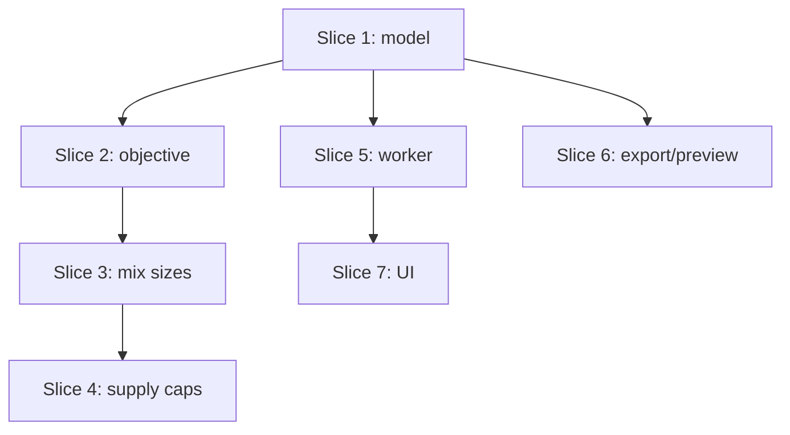

# Plan: Heterogeneous Sheet Sizes

**Created**: 2026-06-27
**Branch**: triage/user-feedback-lightburn-preview-sheets
**Status**: implemented
**Spec**: docs/specs/heterogeneous-sheet-sizes.md

## Goal

Let a nesting job define multiple available material sheet sizes, each with an
optional supply cap, and let the engine mix those sizes freely (choosing per
opened sheet which available size to use) to place all parts with the least total
committed material area. A single-size job remains the degenerate case and must
behave exactly as today.

## Key definitions (resolve reviewer ambiguities up front)

- **Committed area** = `sheet.width × sheet.height` summed over every **opened**
  sheet, using each sheet's own size — _not_ the current `stripHeight ×
sheetWidth` strip proxy. This is the spec's "waste" objective (committed area −
  fixed part area). The strip-density signal is preserved only as a lower-priority
  tie-break (see Slice 2).
- **`availableSheets(config)` normalizer** lives in `geometry/types.ts` (a pure
  function of `NestingConfig`), so the engine, worker-io, and store each import it
  from `types.ts` — no caller couples to `engine.ts` for normalization.
- **Determinism for size-selection tests:** size-mixing behavior is verified two
  ways that do not depend on GA luck — (a) unit tests of the pure
  `selectSheetForNextOpen` helper with stubbed candidate evaluations, and (b)
  geometry-forced engine fixtures (axis-aligned rectangular parts whose areas make
  the size choice deterministic regardless of GA seed). No assertion depends on
  the GA discovering a stochastic optimum.

## Approach stances (high-reversal-cost axes)

- **replace-vs-merge (config shape):** **Merge / expand-before-contract.** Add
  `sheets: MaterialSheet[]` as the authoritative source and keep the existing
  single `config.sheet` as a normalized convenience input. When both are present,
  **`sheets` wins and `sheet` is ignored** (asserted by a scenario). Removing
  `sheet` (contract) is **out of scope**.
- **migrate-vs-edit-stub (result model):** **Expand.** `SheetResult` gains
  authoritative per-sheet dimensions; `NestingResult.sheetWidth/Height` is
  retained as a non-authoritative default (the first sheet's size) so existing
  readers keep working until they migrate.
- **scope:** One coherent feature. **Out of scope:** per-size cost/pricing,
  size preference/ordering bias, and any "prefer fewest distinct sizes" penalty.

## Acceptance Criteria

- [ ] AC1: A single-size job passes all existing engine, bench, and export tests without modification to their inputs/assertions/outputs (PASS = pre-existing suite green with no edits to those test files; the homogeneous bench rows unchanged).
- [ ] AC2: `NestingConfig` accepts ≥1 sheet sizes; the engine nests on a 2-size config without error; an empty size list is rejected with a clear error.
- [ ] AC3: When mixing reduces committed area, the result contains sheets of more than one size and each `SheetResult` reports its own dimensions; `NestingResult` top-level dims default to the first sheet.
- [ ] AC4: On geometry-forced fixtures where mixing yields less committed area, the result's total **committed area** (full W×H per opened sheet) is ≤ each single-size baseline and ≤ any evaluated alternative, with all placeable parts placed; comparator tie-breaks are fewer sheets then less strip area (PASS = confirmed on ≥2 fixtures with a known optimal selection).
- [ ] AC5: Per-size `maxCount` is never exceeded.
- [ ] AC6: When capped supply across all sizes cannot hold every part, the engine stops opening sheets once all in-supply sizes are exhausted (not when `timeBudgetMs` fires) and returns unfittable parts (incl. `required`) in `unplaced` (PASS = no cap exceeded AND unfit parts in `unplaced` AND no sheet opened after exhaustion).
- [ ] AC7: Each exported sheet (SVG + LightBurn) and each preview sheet are sized by that sheet's own dimensions, and the preview shows each sheet's size as text.
- [ ] AC8: Users can add, edit, and remove sheet sizes and set an optional max-count per size (blank ⇒ unlimited); values round-trip through mm/in; the last size cannot be removed; the controls are keyboard- and screen-reader-accessible.

## Slices

### Slice 1: Sheet-list config + per-sheet result dimensions (expand)

**Depends-on:** none
**Files:** `src/lib/geometry/types.ts`, `src/lib/nesting/engine.ts`, `test/nesting/engine.test.ts`

**Behavior:**

```gherkin
Feature: Sheet-list configuration model

  Scenario: A single configured size still nests as before
    Given a nesting config with one sheet size of 600 by 350 mm
    When the engine nests a set of parts that fits on one sheet
    Then the result contains one sheet of 600 by 350 mm
    And no parts appear in the unplaced set
    And the existing single-size engine tests pass without modification

  Scenario: Config accepts a list of available sizes
    Given a nesting config listing sizes 600 by 350 mm and 500 by 400 mm
    When a nest is started with that configuration
    Then the nest completes and returns a result with no error

  Scenario: An empty size list is rejected
    Given a nesting config whose list of sheet sizes is empty
    When a nest is started
    Then an error is raised indicating no sheet sizes are configured
    And no sheets are opened

  Scenario: The sheets list wins when both fields are present
    Given a config with a single sheet of 600 by 350 mm and a sheets list of 500 by 400 mm
    When the available sizes are resolved
    Then the only available size is 500 by 400 mm

  Scenario: A sheet records the size actually used
    Given a nesting config with one sheet size of 600 by 350 mm
    When the engine places parts on a sheet
    Then that sheet reports width 600 and height 350

  Scenario: Top-level result dimensions default to the first sheet
    Given a completed nest whose first sheet is 600 by 350 mm
    When the result's top-level sheet dimensions are read
    Then they are width 600 and height 350
```

**Steps:**

#### Step 1.1: Add sheet-list + supply-cap to the type model

**Complexity**: standard
**RED**: Test `availableSheets(config)` in `types.ts`: single `sheet` ⇒ one-element list; `sheets` present ⇒ that list (and wins over `sheet`); empty `sheets` ⇒ throws/returns an error sentinel; omitted `maxCount` ⇒ unlimited.
**GREEN**: Add `sheets?: MaterialSheet[]` to `NestingConfig`, `maxCount?: number` to `MaterialSheet`, and the pure `availableSheets` normalizer in `geometry/types.ts`.
**REFACTOR**: Route the trivial engine `config.sheet` reads through `availableSheets`; leave deeper reads to later slices.
**Files**: `src/lib/geometry/types.ts`, `src/lib/nesting/engine.ts`, `test/nesting/engine.test.ts`
**Commit**: `feat(nesting): add sheet-list + per-size supply cap to NestingConfig`

#### Step 1.2: Per-sheet dimensions on SheetResult

**Complexity**: standard
**RED**: Test each `SheetResult` reports the size used (600×350 fixture), and `NestingResult.sheetWidth/Height` equals the first sheet's size.
**GREEN**: Add `sheetWidth`/`sheetHeight` to `SheetResult`; set them in `buildSheetResult` from the size passed in; keep `NestingResult` defaults = first/only size.
**REFACTOR**: None needed.
**Files**: `src/lib/geometry/types.ts`, `src/lib/nesting/engine.ts`, `test/nesting/engine.test.ts`
**Commit**: `feat(nesting): record per-sheet dimensions on SheetResult`

### Slice 2: Least-committed-area objective

**Depends-on:** 1
**Files:** `src/lib/nesting/engine.ts`, `test/nesting/engine.test.ts`

**Behavior:**

```gherkin
Feature: Least-waste result selection

  Scenario: Lower committed area wins over fewer sheets
    Given result A committing less total sheet area than result B
    When the engine compares them
    Then it prefers A even if A uses more sheets than B

  Scenario: Fewer sheets breaks an equal-area tie
    Given results A and B with equal committed area but A using fewer sheets
    When the engine compares them
    Then it prefers A

  Scenario: Strip density breaks an equal-area equal-count tie
    Given results A and B with equal committed area and equal sheet count, A packing into less strip height
    When the engine compares them
    Then it prefers A

  Scenario: Single-size ranking is unchanged
    Given two single-size results
    When the engine compares them
    Then the ordering matches the prior feasibility-then-fewer-sheets-then-density behavior
```

**Steps:**

#### Step 2.1: Full-sheet committed area + reordered comparator with density tie-break

**Complexity**: standard
**RED**: Tests for all four scenarios. Include an explicit homogeneous case: two single-size results where the prior comparator and the new comparator must agree (proving the reorder is a no-op for uniform sizes), and a case isolating the strip-density tie-break for equal-count equal-size results so multi-start discrimination is not lost.
**GREEN**: Change `usedArea` to sum each sheet's full `width × height`. Reorder `isBetterResult` to: feasibility → least committed area → fewer sheets → least total strip area. (For one uniform size, committed area is monotonic in sheet count, so ordering is unchanged; the strip term restores the density signal the old `stripHeight × sheetWidth` provided.)
**REFACTOR**: None needed.
**Files**: `src/lib/nesting/engine.ts`, `test/nesting/engine.test.ts`
**Commit**: `feat(nesting): rank nests by least committed material area`

### Slice 3: Engine mixes sizes per opened sheet (unlimited supply)

**Depends-on:** 2
**Files:** `src/lib/nesting/engine.ts`, `test/nesting/engine.test.ts`

**Behavior:**

```gherkin
Feature: Mixed-size sheet selection

  Scenario: The selector picks the least-committed-area size for the next sheet
    Given candidate sizes whose evaluated marginal results are known
    When selectSheetForNextOpen chooses a size
    Then it returns the size giving the least committed area for the parts placed

  Scenario: Engine uses more than one size when geometry forces it
    Given two available sizes and rectangular parts where some fit only the small size and some only the large
    When the engine nests
    Then the result contains sheets of both sizes
    And total committed area is no greater than any single-size run that places all parts

  Scenario: Engine uses one size when that size alone is optimal
    Given two available sizes where all parts fit on one large sheet with room to spare
    When the engine nests
    Then all result sheets use the large size

  Scenario: A part larger than every available size is left unplaced
    Given a part that fits on no available size
    When the engine nests
    Then that part appears in the unplaced set and no empty sheet is opened
```

**Steps:**

#### Step 3.1: Choose the opened sheet's size per the objective and re-seat against it

**Complexity**: complex
**RED**: Unit-test `selectSheetForNextOpen` directly with stubbed candidate evaluations (scenario 1) plus geometry-forced engine fixtures (scenarios 2–4). Assert chosen committed area ≤ each single-size baseline.
**GREEN**: In the sheet-opening loop of `nestPartsIterative`/`nestParts`, evaluate each available size for the next sheet and adopt the size minimizing committed area under the Slice-2 objective. **Evaluation strategy (committed):** a cheap area-fit prefilter discards sizes that cannot hold the next-largest part, then run the GA once on the surviving best candidate (not a full GA per size) to keep per-start cost near today's. **Thread the selected `MaterialSheet` through `finalizePlacement`** — change its signature to take an explicit sheet rather than reading `config.sheet`, so the re-seat pass uses the correct dimensions for every sheet. Fall through to `unplaced` when no size accepts the next part.
**REFACTOR**: Extract `selectSheetForNextOpen(...)` to keep the loop readable.
**Files**: `src/lib/nesting/engine.ts`, `test/nesting/engine.test.ts`
**Commit**: `feat(nesting): mix sheet sizes per opened sheet for least waste`

#### Step 3.2: Generalize lower bound + multi-start sweep to the size set

**Complexity**: complex
**RED**: Test `sheetLowerBound` against the largest available size area (parts totaling 1.5× the large sheet ⇒ bound 2; parts totaling 0.5× large but exceeding one small ⇒ bound 1). Test the multi-start sweep does not regress a mixed-size result.
**GREEN**: Update the three single-size reads in the multi-start path — `sheetLowerBound` (and its call site passing `input.config.sheet`), and the sweep's bin-area guard that uses `config.sheet.width × height` — to operate over the available-size set (largest size for the area bound). In `packIntoKSheets`, assign a size to each of the K groups by independently choosing, per group, the in-supply size minimizing that group's committed area (consistent with `selectSheetForNextOpen`; no combinatorial blowup across groups).
**REFACTOR**: None needed.
**Files**: `src/lib/nesting/engine.ts`, `test/nesting/engine.test.ts`
**Commit**: `feat(nesting): generalize lower bound and multi-start sweep to size set`

### Slice 4: Per-size supply caps + exhaustion handling

**Depends-on:** 3
**Files:** `src/lib/nesting/engine.ts`, `test/nesting/engine.test.ts`

**Behavior:**

```gherkin
Feature: Supply-capped sheet usage

  Scenario: The engine never exceeds a size's max count
    Given only one available size with a max count of 2
    When the engine nests parts needing more than 2 of that size
    Then no more than 2 sheets are opened

  Scenario: All sizes exhaust their caps before all parts are placed
    Given two sizes each capped at 1 sheet
    And a parts set requiring 3 sheets in total
    When the engine nests
    Then the result contains exactly 1 sheet of each size
    And the remaining parts appear in the unplaced set
    And no size's cap is exceeded
    And the nest returns within normal time bounds

  Scenario: Omitted cap means unlimited supply
    Given a size with no max count
    And a parts set requiring 8 sheets of that size to place all parts
    When the engine nests
    Then 8 sheets of that size are present and all parts are placed
```

**Steps:**

#### Step 4.1: Track remaining supply and cap sheet opening

**Complexity**: complex
**RED**: Tests for the three scenarios, including the bounded-termination case with required parts remaining (assert caps respected + parts in `unplaced` + completes within a generous time bound).
**GREEN**: Derive per-size remaining counts from `maxCount`; exclude exhausted sizes from `selectSheetForNextOpen`; when no in-supply size can accept the next part, stop and route remaining parts (incl. `required`) to `unplaced`.
**REFACTOR**: None needed (extraction in 4.2).
**Files**: `src/lib/nesting/engine.ts`, `test/nesting/engine.test.ts`
**Commit**: `feat(nesting): respect per-size supply caps and bound on exhaustion`

#### Step 4.2: Extract supply-pool state from the sheet-opening loop

**Complexity**: standard
**RED**: Unit-test a `SupplyPool` (or equivalent) abstraction: construct from `availableSheets`, report in-supply sizes, decrement on use, report exhaustion.
**GREEN**: Move the per-size remaining-count state out of `nestPartsIterative`/`nestParts` into the named abstraction; both engines consume it. Behavior-preserving.
**REFACTOR**: Confirm `engine.ts` concern count did not grow unbounded; this is the planned TDD-REFACTOR for the supply logic.
**Files**: `src/lib/nesting/engine.ts`, `test/nesting/engine.test.ts`
**Commit**: `refactor(nesting): extract supply-pool state from sheet-opening loop`

### Slice 5: Worker config plumbing

**Depends-on:** 1
**Files:** `src/lib/nesting/nesting-worker.ts`, `src/lib/nesting/worker-io.ts`, `test/nesting/nesting-worker.test.ts`

**Behavior:**

```gherkin
Feature: Sheet-list survives the worker boundary

  Scenario: The size list and caps round-trip through serialization
    Given a config with sizes 600 by 350 mm (max 3) and 500 by 400 mm (unlimited)
    When it is serialized to the worker and rehydrated
    Then the rehydrated config has both sizes with the same caps

  Scenario: A legacy single-sheet message still nests
    Given a serialized config carrying only a single 600 by 350 mm sheet
    When it is rehydrated and nested
    Then the result contains sheets of 600 by 350 mm
```

**Steps:**

#### Step 5.1: Serialize/rehydrate the size list + caps

**Complexity**: standard
**RED**: Tests for both scenarios via the existing pure worker-loop/`worker-io` harness.
**GREEN**: Include `sheets`/`maxCount` in worker config (de)serialization; normalize a legacy single `sheet` on rehydrate via `availableSheets`.
**REFACTOR**: None needed.
**Files**: `src/lib/nesting/nesting-worker.ts`, `src/lib/nesting/worker-io.ts`, `test/nesting/nesting-worker.test.ts`
**Commit**: `feat(nesting): plumb sheet-size list and caps through the worker`

### Slice 6: Per-sheet dimensions in export + preview

**Depends-on:** 1
**Files:** `src/lib/exporters/svg-exporter.ts`, `src/lib/exporters/lightburn-exporter.ts`, `src/lib/components/ExportControls.svelte`, `src/lib/components/LayoutPreview.svelte`, `test/exporters/svg-exporter.test.ts`, `test/exporters/lightburn-exporter.test.ts`, `e2e/mixed-sheet-sizes.spec.ts`

**Behavior:**

```gherkin
Feature: Export and preview honor each sheet's size

  Scenario: A mixed-size SVG export sizes each sheet correctly
    Given a result with one 600 by 350 sheet and one 500 by 400 sheet
    When the layout is exported to SVG
    Then each sheet's SVG width and height match that sheet's own size

  Scenario: A mixed-size LightBurn export sizes each sheet correctly
    Given the same mixed result
    When the layout is exported to LightBurn
    Then each sheet boundary rectangle matches that sheet's own size

  Scenario: Single-size export keeps its dimensions
    Given a single 600 by 350 result
    When it is exported to SVG
    Then the SVG viewBox and dimensions are 600 by 350

  Scenario: The preview renders and labels each sheet at its own size
    Given a mixed-size result rendered in the layout preview
    When the user views the sheets
    Then each sheet is drawn at its own dimensions
    And each sheet header shows its size in the active display unit
```

**Steps:**

#### Step 6.1: Feed per-sheet dimensions into exporters

**Complexity**: standard
**RED**: Exporter tests asserting per-sheet dimensions for a mixed result and unchanged structural output (viewBox/dimensions) for a single-size result. (Structural assertions, not byte-snapshots, to avoid brittleness.)
**GREEN**: Pass each `SheetResult`'s own dimensions to the SVG/LightBurn exporters from `ExportControls` instead of global `result.sheetWidth/Height`.
**REFACTOR**: None needed.
**Files**: `src/lib/exporters/svg-exporter.ts`, `src/lib/exporters/lightburn-exporter.ts`, `src/lib/components/ExportControls.svelte`, `test/exporters/svg-exporter.test.ts`, `test/exporters/lightburn-exporter.test.ts`
**Commit**: `feat(exporters): size each exported sheet by its own dimensions`

#### Step 6.2: Render and label each preview sheet at its own size

**Complexity**: standard
**RED**: Add an e2e (`e2e/mixed-sheet-sizes.spec.ts`) asserting a mixed-size result renders two sheet regions whose rendered dimensions/aspect ratios differ correctly and whose headers show the two sizes. (Per AC7 the preview is covered by an automated e2e check, not a manual visual check.)
**GREEN**: In `LayoutPreview.svelte` use each `SheetResult`'s dimensions for the per-sheet `viewBox`/rect, and add a "Size: W × H" stat to the sheet header alongside Parts/Strip/Use.
**REFACTOR**: None needed.
**Files**: `src/lib/components/LayoutPreview.svelte`, `e2e/mixed-sheet-sizes.spec.ts`
**Commit**: `feat(ui): render and label each preview sheet at its own size`

### Slice 7: UI — editable list of sheet sizes

**Depends-on:** 5
**Files:** `src/lib/components/MaterialSettings.svelte`, `src/lib/stores/project.svelte.ts`, `test/stores/project.test.ts`

**Behavior:**

```gherkin
Feature: Manage available sheet sizes

  Scenario: Add a second sheet size
    Given the material settings show one sheet size
    When the user adds a size
    Then a new row appears pre-filled with the last (most recently configured) size's dimensions
    And both sizes are present in the configuration

  Scenario: Edit an existing sheet size
    Given a configured size of 600 by 350 mm
    When the user changes its width to 650 mm
    Then the material settings show 650 by 350 mm for that size

  Scenario: Remove a sheet size when more than one exists
    Given two configured sizes
    When the user removes one
    Then only the other size remains

  Scenario: The last size cannot be removed
    Given exactly one configured size
    When the user views its row
    Then its remove control is disabled with an explanatory tooltip

  Scenario: Set a supply cap on a size
    Given a configured size
    When the user sets its max sheets to 5
    Then that size is capped at 5

  Scenario: Blank max sheets means unlimited
    Given a configured size whose max sheets field is blank
    When the configuration is read
    Then that size has no cap

  Scenario: Sizes round-trip through inch display
    Given the display unit is inches
    When the user enters a size in inches
    Then the stored size is the equivalent in millimetres
```

**Steps:**

#### Step 7.1: Store mutators for a list of sizes + caps

**Complexity**: standard
**RED**: Store tests for add (copy-forward defaults), edit, remove, last-size protection, set/clear cap (blank ⇒ no cap; reject/coerce a cap < 1), and mm/in round-trip.
**GREEN**: Replace single-sheet mutators with list operations (`addSheetSize`/`removeSheetSize`/`updateSheetSize`/`setSheetMaxCount`) storing mm; keep a back-compat single-size accessor; enforce ≥1 size always.
**REFACTOR**: None needed.
**Files**: `src/lib/stores/project.svelte.ts`, `test/stores/project.test.ts`
**Commit**: `feat(store): manage a list of material sheet sizes with caps`

#### Step 7.2: MaterialSettings list UI (accessible)

**Complexity**: standard
**RED**: Component test that settings render one row per size with width/height/"Max sheets" fields and add/remove controls; the lone remaining row's remove is disabled; each remove button has an aria-label naming its row's size.
**GREEN**: Replace the single width/height pair in `MaterialSettings.svelte` with an editable list bound to the new mutators. Per row: reuse `DimensionInput` for width/height; a "Max sheets" number input with `min=1`, `placeholder="unlimited"`, and a hint that blank = unlimited; a remove button with `aria-label="Remove <W> × <H>"`, disabled (with tooltip) when one row remains. Manage focus: after Add, focus the new row's first input; after Remove, focus the prior row's remove button (or Add when none precede). Use the label **"Max sheets"** consistently (store mutator, component, tooltip).
**REFACTOR**: None needed.
**Files**: `src/lib/components/MaterialSettings.svelte`
**Commit**: `feat(ui): editable, accessible list of sheet sizes in material settings`

## Parallelization



| Wave | Slices (parallel) |
| ---- | ----------------- |
| 1    | 1                 |
| 2    | 2, 5, 6           |
| 3    | 3, 7              |
| 4    | 4                 |

## Complexity Classification

Steps 3.1, 3.2, 4.1 are `complex` (core algorithm, feasibility/termination semantics). All others are `standard`. No `trivial` steps.

## Pre-PR Quality Gate

- [ ] All tests pass
- [ ] Type check passes
- [ ] Linter passes
- [ ] `npm run bench` shows no regression on the homogeneous `lego-shelves` rows
- [ ] `/code-review` passes
- [ ] Documentation updated (CLAUDE.md nesting-pipeline note + spec cross-reference)

## Risks & Open Questions

- **Marginal size selection cost.** Mitigated by the committed evaluation strategy in Step 3.1 (area-fit prefilter → single GA on the survivor), bounded by the existing time budget and validated by the bench gate.
- **Objective reorder ripple.** The area-first comparator must remain a no-op for homogeneous jobs — covered by the explicit unchanged-ranking test and the strip-density tie-break (Slice 2) plus the bench gate.
- **`finalizePlacement` dimension threading.** Resolved as an explicit sub-task in Step 3.1; the re-seat pass must use the selected per-sheet size, not `config.sheet`.
- **Open:** Eventual removal of `NestingResult.sheetWidth/Height` (contract phase) — deferred, out of scope.

### Follow-ups (from final review — non-blocking, accepted)

- Intermediate progress frames omit `supplyStranded` from the live `unplaced` count (the final result is correct); preview-only cosmetic under-report once a size exhausts mid-nest.
- `partFitsSheet` (fittability prefilter) uses bbox in both 90° orientations and ignores `grainConstraint`/`lockOrientation`; a grain-locked part that fits only when rotated is classified fittable but correctly ends in `unplaced` via the empty-placement break guards (no loop). Optimistic-bound approximation.
- Non-priority-aware allocation: when a larger `optional` part competes with a smaller `required` part for one scarce capped sheet, allocation isn't guaranteed priority-first (the spec only requires optional parts not force new sheets).
- Density (NFP) mode + many sizes can hit the time budget mid-pack and return a best-so-far partial; consistent with the documented density-first tradeoff.

## Build Progress

### Slices (grouped by wave)

#### Wave 1

- [x] Slice 1: Sheet-list config + per-sheet result dimensions
  - [x] Step 1.1: Add sheet-list + supply-cap to the type model
  - [x] Step 1.2: Per-sheet dimensions on SheetResult

#### Wave 2

- [x] Slice 2: Least-committed-area objective
  - [x] Step 2.1: Full-sheet committed area + reordered comparator with density tie-break
- [x] Slice 5: Worker config plumbing
  - [x] Step 5.1: Serialize/rehydrate the size list + caps
- [x] Slice 6: Per-sheet dimensions in export + preview
  - [x] Step 6.1: Feed per-sheet dimensions into exporters
  - [x] Step 6.2: Render and label each preview sheet at its own size

#### Wave 3

- [x] Slice 3: Engine mixes sizes per opened sheet
  - [x] Step 3.1: Choose the opened sheet's size per the objective and re-seat against it
  - [x] Step 3.2: Generalize lower bound + multi-start sweep
- [x] Slice 7: UI — editable list of sheet sizes
  - [x] Step 7.1: Store mutators for a list of sizes + caps
  - [x] Step 7.2: MaterialSettings list UI (accessible)

#### Wave 4

- [x] Slice 4: Per-size supply caps + exhaustion handling
  - [x] Step 4.1: Track remaining supply and cap sheet opening
  - [x] Step 4.2: Extract supply-pool state from the sheet-opening loop

## Plan Review Summary

**Plan tier: complex** — reviewers: Acceptance, Design, UX, Strategic, Parallelization (all 5; tier driven by 4 waves, 7 slices, `complex` steps, and stances on high-reversal-cost axes). Resolved at the `medium` band (claude-sonnet-4-6).

**Verdicts (after one revision iteration): all 5 approve.**

Iteration 1 raised blockers — Design: `finalizePlacement` hard-coded `config.sheet` (re-seat would use wrong dims); Acceptance: ambiguous "committed area" (strip vs full sheet), three stochastic GA-driven Slice-3 scenarios, Step 6.2 manual-only preview check; UX: Remove buttons lacked ARIA labels and focus management. All fixed in the revision (selected sheet threaded through `finalizePlacement`; committed area = full W×H with a strip-density tie-break + homogeneous no-op test; Slice-3 verified via pure `selectSheetForNextOpen` unit tests + geometry-forced fixtures; e2e preview check; per-row ARIA + focus). Iteration 2 (Design, Acceptance, UX) re-reviewed → approve.

**Non-blocking observations carried into build:**

- Step 3.1's evaluation strategy (area-fit prefilter → single GA on the survivor) makes size selection a heuristic; AC4's "least committed area" means "least among evaluated candidates" — assert against the geometry-forced fixtures, validate density with the bench gate.
- Strategic: confirm the `packIntoKSheets` per-group size-assignment stays simple (per-group independent choice) to avoid combinatorial blowup.
- Acceptance: focus-move-after-add/remove is covered by component tests + ARIA assertions; an explicit focus scenario is optional.

## Approval

Approved by human on 2026-06-27.

### Acceptance Criteria

- [x] AC1: Single-size job passes existing engine/bench/export tests unmodified (no regression)
- [x] AC2: Config accepts ≥1 sizes; nests on 2-size; empty list rejected
- [x] AC3: Mixed-size result; each SheetResult reports own dims; result default = first sheet
- [x] AC4: Least committed area (full W×H) chosen; fewer sheets then strip tie-breaks
- [x] AC5: Per-size maxCount never exceeded
- [x] AC6: Supply exhaustion → unplaced, bounded
- [x] AC7: Export + preview use per-sheet dimensions; preview shows size text (preview e2e runs post-Slice-7)
- [x] AC8: UI add/edit/remove sizes + caps, mm/in round-trip, last-size guard, accessible
