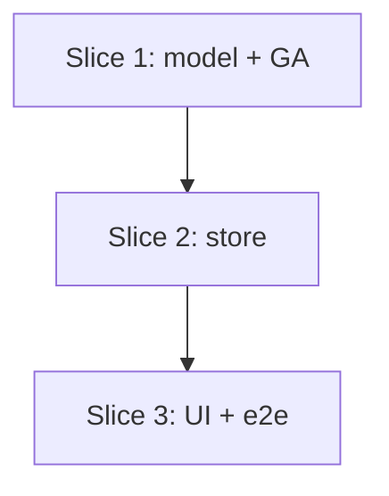

# Plan: Per-Part "Lock Orientation"

**Created**: 2026-06-21
**Branch**: claude/happy-mayer-fjta2s
**Status**: approved

## Goal

Add a per-part "Lock orientation" toggle so the nesting genetic algorithm never
mirrors/flips an orientation-specific part (engraving, finished side, asymmetric
features). The flag lives on `Part`, persists in the project store across re-dedup,
is enforced at consumption time in the GA, and is surfaced as a per-row control in
the Part List. Default is **unlocked** — today's behavior, density, and bench
numbers are unchanged.

## Approach Stance (decision-defaults axes)

- **Replace-vs-merge**: additive. New optional field + new store map + new UI control;
  no existing behavior altered when unset.
- **Scope**: consumption-time clamp **only** (`toOrderedParts`). The optional
  gene-level GA skip in `createRandomIndividual`/`mutate`/`crossover` is **deferred** —
  the clamp is correct and sufficient; per issue #33 guidance, ship only the clamp.
- **Format fidelity / migrate-vs-stub / auto-merge**: not applicable.

## Acceptance Criteria

- [ ] A per-part "Lock orientation" toggle appears in the Part List and persists through a tolerance change (re-dedup).
- [ ] With a part locked, no placed instance of it is ever mirrored across seeds/generations (unit-proven).
- [ ] A control (unlocked) part is not forced unmirrored by the flag.
- [ ] Unlocked parts behave exactly as today; default is unlocked; engine/bench defaults unchanged.
- [ ] E2e: toggling the control and nesting with a short time limit completes without error.
- [ ] `npm run lint`, `npm run check`, `npm test`, `npx playwright test` all green.

## Plan Review Summary

Five personas reviewed; all **approve** after one revision round (Acceptance + UX initially `needs-revision`, blockers fixed and re-approved).

- **Parallelization** — approve. Strictly sequential type→store→UI chain; no same-wave collisions.
- **Strategic** — approve. Minimal, additive, reversible; warnings: track deferred gene-skip as a follow-up (added to Risks); `setLockOrientation` clears `state.result` while `setQuantity` doesn't (intentional — rationale added to Step 2.1).
- **Design** — approve. Correct single-point clamp; clamp index mapping verified correct. Warnings folded: name store test `.svelte.test.ts`; set `lockOrientation` before `state.parts = uniqueParts` in `runDedup`.
- **Acceptance** — approve (after revision). Replaced non-deterministic emergent-GA assertions with direct deterministic `toOrderedParts` unit tests; pinned N≥20 seeds + rotation-diversity; added quantity>1 all-instances coverage; guarded all three engine spread sites; documented re-dedup id-stability scope.
- **UX** — approve (after revision). Added `<label for>` accessible name identifying the part, single list-level `aria-describedby` hint, committed `#lock-<id>` selector, consistent "never mirrored / rotation still optimized" terminology, e2e a11y + round-trip check.

## Slices

### Slice 1: Lock flag on the model + GA enforcement

**Depends-on:** none
**Files:** `src/lib/geometry/types.ts`, `src/lib/nesting/optimizer.ts`, `test/nesting/lock-orientation.test.ts`

**Behavior:**

```gherkin
Feature: The nester never flips a locked part

  Scenario: A locked part is never mirrored, every instance
    Given a part marked "lock orientation" with quantity greater than one
    And other unlocked parts
    When the layout is optimized over a fixed set of random seeds
    Then every placed instance of the locked part has mirror false
    And the locked part still exhibits more than one rotation across seeds (rotation stays free)

  Scenario: The clamp only fires for locked parts (deterministic)
    Given an ordered individual whose mirror gene is true for an unlocked part at some position
    When that individual is converted to ordered parts
    Then the unlocked part's resulting mirror is true (its gene is preserved)

  Scenario: No lock set preserves mirror genes verbatim
    Given an ordered individual with arbitrary mirror genes and no part is locked
    When that individual is converted to ordered parts
    Then each resulting mirror equals the corresponding input mirror gene
```

**Steps:**

#### Step 1.1: Add `lockOrientation` to `Part`

**Complexity**: trivial
**RED**: N/A (type-only); covered by Step 1.2's test compiling against the field.
**GREEN**: Add `/** When true, the nester must not mirror/flip this part. */ lockOrientation?: boolean;` to `Part` in `types.ts`.
**REFACTOR**: None needed.
**Files**: `src/lib/geometry/types.ts`
**Commit**: `feat(types): add optional Part.lockOrientation flag (#33)`

#### Step 1.2: Clamp mirror off for locked parts in `toOrderedParts`

**Complexity**: standard
**RED**: New `test/nesting/lock-orientation.test.ts`. Two deterministic groups:

1. **Direct `toOrderedParts` unit tests** (export it for test, or test via a thin wrapper) — fully deterministic, no GA randomness:
   - locked part + an `Individual` whose `mirrors` are all `true` ⇒ the locked part's output `mirror === false`, **and** an unlocked part at another position keeps `mirror === true` (proves the clamp only fires for locked parts — the "control" case, deterministic, replaces the old emergent-GA assertion).
   - no part locked + arbitrary `mirrors` ⇒ output mirrors equal the input genes verbatim (AC4 "behave exactly as today").
2. **Integration over fixed seeds** — seed `Math.random` (the LCG used in `optimizer.test.ts`) for **N ≥ 20** distinct seeds; on each, run `optimize(...)` on parts where one (quantity > 1) has `lockOrientation: true`; assert **every** `PlacedPart` of that id has `mirror === false`, and that the locked part shows **> 1 distinct rotation** across the seed set (rotation still optimized).
   **GREEN**: In `toOrderedParts`, change `mirror: individual.mirrors[i]` → `mirror: parts[idx].lockOrientation ? false : individual.mirrors[i]`.
   **REFACTOR**: None needed.
   **Files**: `src/lib/nesting/optimizer.ts`, `test/nesting/lock-orientation.test.ts`
   **Commit**: `feat(nesting): never mirror a lock-orientation part (#33)`

#### Step 1.3: Confirm flag survives engine expansion and round-trip

**Complexity**: trivial
**RED**: Extend `lock-orientation.test.ts` — verify `lockOrientation: true` survives through **all three** spread sites named in the spec: `expandParts` (quantity expansion), `simplifyPartsForNesting`, and the `withOriginalGeometry` round-trip (assert a placed instance's `part.lockOrientation === true` after a full `nestParts`). Guard test; no production change expected.
**GREEN**: No change expected; if a spread drops it, add the field explicitly at the offending site.
**REFACTOR**: None needed.
**Files**: `test/nesting/lock-orientation.test.ts` (and `src/lib/nesting/engine.ts` only if the guard fails)
**Commit**: `test(nesting): guard lockOrientation through engine transforms (#33)`

### Slice 2: Persist the choice in the project store

**Depends-on:** 1
**Files:** `src/lib/stores/project.svelte.ts`, `test/stores/project.svelte.test.ts`

**Behavior:**

```gherkin
Feature: Locking survives a tolerance change

  Scenario: Toggling lock orientation sets the part flag
    Given a deduplicated part list
    When the user marks a part "lock orientation"
    Then that part reports lockOrientation true
    And any prior nesting result is cleared

  Scenario: Lock state survives re-deduplication
    Given a part marked "lock orientation"
    When the shape-matching tolerance is changed and parts are re-deduplicated
    Then the part is still marked "lock orientation"

  Scenario: Reset clears all lock state
    Given one or more parts marked "lock orientation"
    When the project is reset
    Then no part is marked "lock orientation"
```

**Steps:**

#### Step 2.1: Add `lockedOrientation` map + `setLockOrientation`

**Complexity**: standard
**RED**: New `test/stores/project.svelte.test.ts` (`.svelte.test.ts` so module-level `$state` runes compile under the `sveltekit()` vite plugin). Build parts via `setParts`; call `setLockOrientation(id, true)`; assert the matching `state.parts` entry has `lockOrientation === true` and `state.result === null`. Also assert `setLockOrientation` on an **unknown id** is a no-op (no part flagged).
**GREEN**: Add `lockedOrientation: Map<string, boolean>` to `ProjectState` (default `new Map()`); add `setLockOrientation(partId, locked)` that updates the map (new `Map` for reactivity), replaces the matching part object in a new `state.parts` array (Svelte 5 reactivity), and clears `state.result`. Rationale (note in code): unlike `setQuantity`, a lock change alters placement validity, so the prior result is invalidated.
**REFACTOR**: None needed.
**Files**: `src/lib/stores/project.svelte.ts`, `test/stores/project.svelte.test.ts`
**Commit**: `feat(store): setLockOrientation persists per-part lock (#33)`

#### Step 2.2: Re-apply lock map in `runDedup`; clear in `reset`

**Complexity**: standard
**RED**: Extend store test — set lock, call `setMatchTolerance(...)` to trigger `runDedup`, assert the part still has `lockOrientation === true`; then `reset()` and assert `lockedOrientation` is empty and parts cleared.
**GREEN**: In `runDedup`, apply each part's `lockOrientation` from `state.lockedOrientation` onto the freshly-built `uniqueParts` **before** `state.parts = uniqueParts` (no post-assignment mutation of reactive state; absent id ⇒ left unlocked). Add `lockedOrientation: new Map()` to the `reset()` state literal.
**Note (scope)**: the lock map is keyed by part id; persistence holds while ids are stable across re-dedup. If a tolerance change remaps/merges ids, a dropped id's lock is discarded (absent ⇒ unlocked) — documented, acceptable behavior, not a regression.
**REFACTOR**: None needed.
**Files**: `src/lib/stores/project.svelte.ts`, `test/stores/project.svelte.test.ts`
**Commit**: `feat(store): preserve lock across re-dedup, clear on reset (#33)`

### Slice 3: Part List toggle + e2e

**Depends-on:** 2
**Files:** `src/lib/components/PartList.svelte`, `e2e/nesting.test.ts`

**Behavior:**

```gherkin
Feature: Lock orientation control in the Part List

  Scenario: User locks a part and nests
    Given an uploaded file with parts
    When the user enables "Lock orientation" on a part
    Then the control reflects the locked state (checked round-trips)
    And running the nest with a short time limit completes without error

  Scenario: The control is accessible
    Given the Part List is showing parts
    Then each lock control has an accessible name identifying the part it controls
```

**Steps:**

#### Step 3.1: Add per-row "Lock orientation" control + hint

**Complexity**: standard
**RED**: Add e2e steps in `e2e/nesting.test.ts`: upload fixture; locate the lock control by its committed stable selector `#lock-<id>`; assert it round-trips (check it, expect checked); set a short time limit; run nest; assert completion (reuse existing nest-completion assertions).
**GREEN**: In `PartList.svelte` add, near `.qty`, a checkbox bound to `part.lockOrientation`, `onchange` → `projectStore.setLockOrientation(part.id, checked)`. Accessibility (blocker fix):

- stable `id={`lock-${part.id}`}` (single committed selector),
- an associated `<label for={`lock-${part.id}`}>` whose accessible name **identifies the part** (e.g. `Lock orientation: ${part.name}`, or visible "Lock orientation" + visually-hidden part name), satisfying the accessibility scenario,
- `aria-describedby` pointing at one shared hint element rendered **once** inside the same `{#if parts.length > 0}` block (always present whenever a control references it; keeps per-row density low).
  Hint text (consistent terminology): "Locked parts are never **mirrored** during nesting; rotation and placement are still optimized." Style consistent with existing `.qty` controls.
  **REFACTOR**: None needed.
  **Files**: `src/lib/components/PartList.svelte`, `e2e/nesting.test.ts`
  **Commit**: `feat(ui): per-part Lock orientation toggle in Part List (#33)`

## Parallelization

Slices are strictly sequential: each depends on the prior (type → store → UI).



| Wave | Slices (parallel) |
| ---- | ----------------- |
| 1    | 1                 |
| 2    | 2                 |
| 3    | 3                 |

## Complexity Classification

See per-step ratings. Most steps are `standard`; type/guard steps are `trivial`. No
`complex` steps — additive, behind an unset-by-default flag.

## Pre-PR Quality Gate

- [ ] All tests pass
- [ ] Type check passes
- [ ] Linter passes
- [ ] `/code-review` passes
- [ ] Documentation updated (if applicable)

## Risks & Open Questions

- **Store testability**: no `test/stores/` tests exist yet. `.svelte.ts` runes compile
  under the `sveltekit()` vite plugin in vitest, so importing `projectStore` in a plain
  `.test.ts` should work; if `$state` access throws outside a component, fall back to
  naming the test `project.svelte.test.ts`. Verify early in Slice 2.
- **`mirrors` index mapping**: the clamp is keyed by part **index** (`parts[idx]`),
  not order position — matching `order[i] = idx`. Correct by construction; the deferred
  gene-level skip is what would be error-prone, hence deferred.
- **Bench invariance**: bench fixtures never set the flag, so numbers must not move.
- **Deferred follow-up**: the gene-level GA skip (skip the dead mirror gene for locked
  parts in `createRandomIndividual`/`mutate`/`crossover`) is intentionally out of scope;
  track as a separate issue. For projects with many locked parts the GA still spends ~half
  each locked part's mirror-gene search on clamped-away values — correctness is unaffected.

## Build Progress

### Slices (grouped by wave)

#### Wave 1

- [x] Slice 1: Lock flag on the model + GA enforcement
  - [x] Step 1.1: Add `lockOrientation` to `Part`
  - [x] Step 1.2: Clamp mirror off for locked parts in `toOrderedParts`
  - [x] Step 1.3: Confirm flag survives engine expansion and round-trip

#### Wave 2

- [x] Slice 2: Persist the choice in the project store
  - [x] Step 2.1: Add `lockedOrientation` map + `setLockOrientation`
  - [x] Step 2.2: Re-apply lock map in `runDedup`; clear in `reset`

#### Wave 3

- [ ] Slice 3: Part List toggle + e2e
  - [ ] Step 3.1: Add per-row "Lock orientation" control + hint

### Acceptance Criteria

- [ ] A per-part "Lock orientation" toggle appears in the Part List and persists through a tolerance change (re-dedup).
- [ ] With a part locked, no placed instance of it is ever mirrored across seeds/generations (unit-proven).
- [ ] A control (unlocked) part is not forced unmirrored by the flag.
- [ ] Unlocked parts behave exactly as today; default is unlocked; engine/bench defaults unchanged.
- [ ] E2e: toggling the control and nesting with a short time limit completes without error.
- [ ] `npm run lint`, `npm run check`, `npm test`, `npx playwright test` all green.
